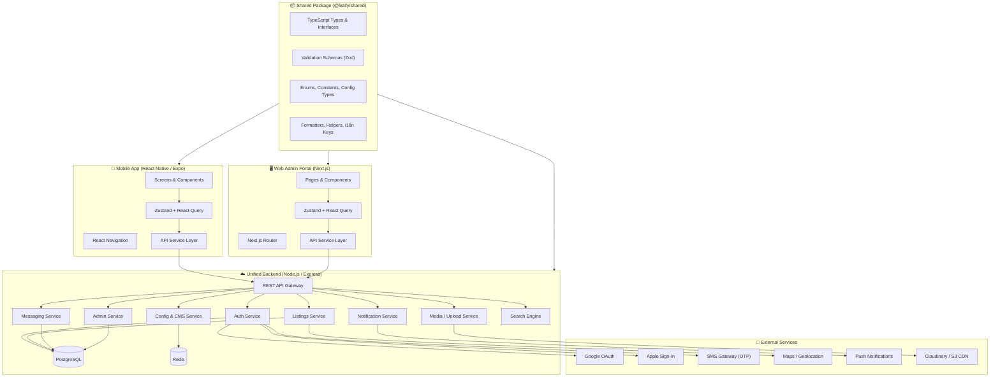
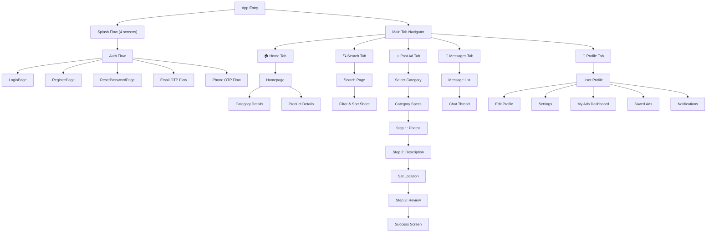
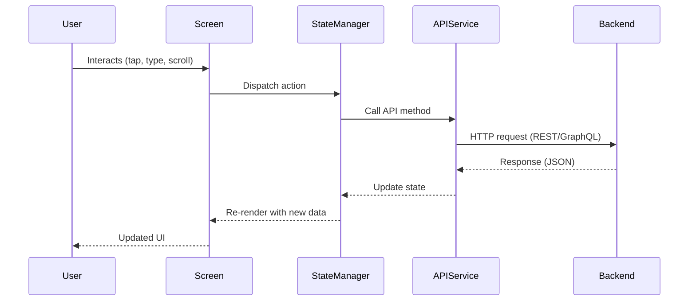
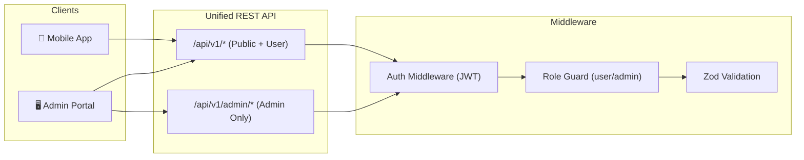
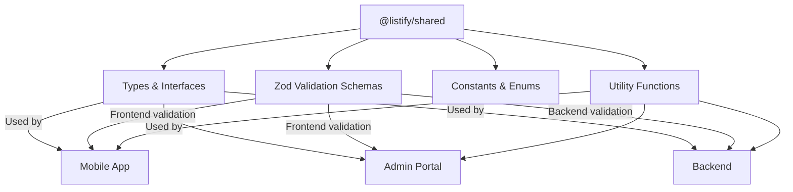

# Listify — Platform Architecture Document

> **Version:** 2.0  
> **Last Updated:** 2026-10-07  
> **Scope:** Mobile App + Web Admin Portal + Unified Backend

---

## 1. Platform Overview — Unified Architecture

> [!IMPORTANT]
> Listify is a **3-part platform** — Mobile App, Web Admin Portal, and a single Unified Backend. All three share one codebase philosophy: **less code, high impact**.



---

## 2. Tech Stack

### 📱 Mobile App
| Layer | Technology | Version |
|-------|-----------|---------|
| Runtime | React Native | 0.81.5 |
| Framework | Expo (Managed) | SDK 54 |
| Language | TypeScript | 5.9.2 |
| Navigation | React Navigation (Native Stack) | 7.x |
| State | Zustand + TanStack Query | Latest |
| Forms | React Hook Form + Zod | Latest |
| Gradients | expo-linear-gradient | 15.x |
| Icons | @expo/vector-icons | 15.x |
| Build | EAS CLI | Latest |

### 🖥️ Web Admin Portal
| Layer | Technology | Version |
|-------|-----------|---------|
| Framework | Next.js (App Router) | 14.x |
| Language | TypeScript | 5.9.2 |
| Styling | Tailwind CSS | 3.x |
| State | Zustand + TanStack Query | Latest |
| Forms | React Hook Form + Zod | Latest |
| Tables | TanStack Table | Latest |
| Charts | Recharts | Latest |
| Auth | NextAuth.js | Latest |

### ☁️ Unified Backend
| Layer | Technology | Version |
|-------|-----------|---------|
| Runtime | Node.js | 20.x LTS |
| Framework | Express.js | 4.x |
| Language | TypeScript | 5.9.2 |
| Database | PostgreSQL | 16.x |
| ORM | Prisma | Latest |
| Cache | Redis | 7.x |
| Auth | JWT + bcrypt | Latest |
| File Upload | Multer + Cloudinary | Latest |
| Validation | Zod (shared with frontend) | Latest |
| Real-time | Socket.io | Latest |
| Search | PostgreSQL Full-Text / Elasticsearch | Latest |

### 📦 Shared Package
| Layer | Technology | Purpose |
|-------|-----------|--------|
| Types | TypeScript interfaces | Shared between all 3 projects |
| Validation | Zod schemas | Same validation on frontend + backend |
| Constants | Enums, config types | Single source of truth |
| Utils | Formatters, helpers | Price formatting, date utils, etc. |

---

## 3. Project Structure

```
Listify-app/
├── App.tsx                          # Root navigator setup
├── package.json                     # Dependencies & scripts
├── src/
│   └── screens/                     # All screens as folders
│       ├── SpashScreen/             # Onboarding splash 1
│       ├── SpashScreen2/            # Onboarding splash 2
│       ├── SpashScreen3/            # Onboarding splash 3
│       ├── SpashScreen4/            # Onboarding splash 4
│       ├── LoginPage/               # Email + password login
│       ├── RegisterPage/            # Full registration form
│       ├── EmailOTPPage/            # Email OTP entry
│       ├── EmailOTPVerfication/     # Email OTP verification
│       ├── PhoneOTPPage/            # Phone OTP entry
│       ├── PhoneOTPVerification/    # Phone OTP verification
│       ├── ResetPasswordPage/       # Password reset
│       ├── Homepage/                # Main feed + categories
│       ├── Category_DetailsPage/    # Category listing grid
│       ├── ProductDetailsPage/      # Full product view (in both parts)
│       ├── SearchPage/              # Search interface
│       ├── FilterSortBottomSheet/   # Filter & sort modal
│       ├── PostAnAdSelectCategory/  # Ad wizard: category pick
│       ├── PostAnAdStep1PhotosBasicInfo/   # Step 1 variants (×4)
│       ├── PostAnAdStep2DescriptionPricing/ # Step 2
│       ├── PostAnAdStep3ReviewPublish/      # Step 3: review
│       ├── PostAnAdSetLocation/     # Map location picker
│       ├── PostAnAdMobilesTabletsDetailsSpecs/  # Mobile specs
│       ├── PostAnAdVehiclesCarsDetailsSpecs/    # Vehicle specs
│       ├── PostAnAdPropertyForSaleRentDetailsSpecs/ # Property specs
│       ├── PostAnAdSuccessScreen/   # Post success
│       ├── MyAdsSellerDashboard/    # Seller's ads list
│       ├── MessagePage/             # Conversation list
│       ├── MessageGroupPage/        # Chat thread
│       ├── UserProfile/             # Public profile
│       ├── EditProfile/             # Edit profile form
│       ├── Settings/                # App settings
│       ├── NotificationsActivityFeed/ # Notifications
│       ├── SavedAdsFavorites/       # Bookmarked ads
│       └── SafetyModerationReportSheet/ # Report modal
```

---

## 4. Navigation Architecture



> **Note:** Currently using a custom state-driven router (`AppNavigator.tsx`) with `ScreenPreviewSwitcher` to toggle between all 33 views for rapid UI development and review. The recommended long-term architecture above groups screens into logical `React Navigation` tab and nested stack navigators for production.

---

## 5. Data Flow Architecture



---

## 6. Screen Component Pattern

Each screen follows a consistent folder structure:

```
ScreenName/
└── index.tsx      # Screen component with inline styles
```

**Current Pattern:**
- Screens are functional components exported as default
- Using `SafeAreaView` as root wrapper
- `ScrollView` for scrollable content
- Inline `style` objects (no StyleSheet.create)
- Images loaded from remote CDN URLs
- `TouchableOpacity` for interactive elements
- `TextInput` with `useState` for form fields

---

## 7. Key Architecture Decisions

| Decision | Current State | Recommended |
|----------|--------------|-------------|
| **State Management** | Local `useState` per screen | Zustand + TanStack Query (shared pattern across app & admin) |
| **API Layer** | Not implemented (static UI) | Axios with typed service modules (shared types from `@listify/shared`) |
| **Styling** | Inline styles | StyleSheet.create + theme from API config |
| **Image Hosting** | tagjs CDN (temp URLs) | Cloudinary CDN with backend upload service |
| **Forms** | Manual `useState` | React Hook Form + Zod (schemas shared between frontend & backend) |
| **Navigation** | Flat stack (all screens) | Nested tab + stack navigators |
| **Authentication** | UI only | JWT auth with role-based access (user/admin) |
| **Backend** | None | Unified Node.js/Express serving both app & admin |
| **Database** | None | PostgreSQL with Prisma ORM |
| **Real-time** | None | Socket.io for chat + live notifications |
| **Admin Portal** | None | Next.js web dashboard for full platform management |
| **Shared Code** | None | `@listify/shared` package for types, validators, utils |

---

## 8. Unified Backend Architecture

> [!IMPORTANT]
> **ONE backend serves BOTH the mobile app AND the web admin portal.** Same database, same auth system, same API — different role-based permissions.



### API Route Structure

```
/api/v1/
├── auth/                    # Both app & admin
│   ├── POST /login
│   ├── POST /register
│   ├── POST /otp/send
│   ├── POST /otp/verify
│   ├── POST /password/reset
│   └── POST /social/:provider
├── config/                  # App config (consumed by mobile app)
│   ├── GET /app             # AppConfig (name, theme, currency, features)
│   ├── GET /categories      # Dynamic categories + fields
│   ├── GET /filters         # Filter/sort options
│   ├── GET /onboarding      # Onboarding slides
│   └── GET /i18n/:locale    # Translation strings
├── listings/                # Marketplace
│   ├── GET /                # Browse (with filters, pagination)
│   ├── GET /:id             # Detail
│   ├── POST /               # Create (sellers)
│   ├── PUT /:id             # Update (owner)
│   ├── DELETE /:id          # Delete (owner/admin)
│   └── POST /:id/report     # Report listing
├── users/                   # Profiles
│   ├── GET /me              # Current user
│   ├── PUT /me              # Update profile
│   ├── GET /:id             # Public profile
│   └── GET /me/favorites    # Saved ads
├── messages/                # Chat
│   ├── GET /conversations   # Inbox
│   ├── GET /:conversationId # Thread
│   └── POST /               # Send message
├── notifications/           # Notifications
│   └── GET /                # Activity feed
├── media/                   # File uploads
│   └── POST /upload         # Image upload → CDN
│
└── admin/                   # 🔒 Admin-only routes
    ├── dashboard/
    │   └── GET /stats        # Platform analytics
    ├── config/
    │   ├── PUT /app           # Update app config
    │   ├── PUT /theme         # Update theme/colors
    │   └── PUT /features      # Toggle feature flags
    ├── categories/
    │   ├── POST /             # Create category
    │   ├── PUT /:id           # Update category
    │   ├── DELETE /:id        # Delete category
    │   └── PUT /:id/fields    # Manage dynamic fields
    ├── listings/
    │   ├── GET /              # All listings (with mod status)
    │   ├── PUT /:id/status    # Approve/reject/feature
    │   └── GET /reports       # Reported listings
    ├── users/
    │   ├── GET /              # All users
    │   ├── PUT /:id/status    # Ban/verify user
    │   └── PUT /:id/role      # Change role
    ├── content/
    │   ├── GET /sections      # Homepage sections
    │   ├── PUT /sections      # Reorder/rename sections
    │   ├── GET /onboarding    # Onboarding slides
    │   └── PUT /onboarding    # Update slides
    └── i18n/
        ├── GET /:locale       # Translation strings
        └── PUT /:locale       # Update translations
```

### Backend Folder Structure

```
backend/
├── prisma/
│   ├── schema.prisma          # Database schema
│   └── migrations/            # Auto-generated migrations
├── src/
│   ├── app.ts                 # Express app setup
│   ├── server.ts              # Server entry point
│   ├── routes/
│   │   ├── auth.routes.ts
│   │   ├── config.routes.ts
│   │   ├── listing.routes.ts
│   │   ├── user.routes.ts
│   │   ├── message.routes.ts
│   │   ├── media.routes.ts
│   │   └── admin/             # Admin-only routes
│   │       ├── dashboard.routes.ts
│   │       ├── config.routes.ts
│   │       ├── categories.routes.ts
│   │       ├── listings.routes.ts
│   │       ├── users.routes.ts
│   │       └── content.routes.ts
│   ├── controllers/           # Route handlers
│   ├── services/              # Business logic
│   ├── middleware/
│   │   ├── auth.middleware.ts
│   │   ├── roleGuard.middleware.ts
│   │   ├── validate.middleware.ts  # Uses Zod from @listify/shared
│   │   └── upload.middleware.ts
│   ├── socket/                # Socket.io handlers
│   │   ├── chat.handler.ts
│   │   └── notification.handler.ts
│   ├── utils/
│   └── config/
├── package.json
└── tsconfig.json              # References @listify/shared
```

---

## 9. Monorepo Structure (Full Platform)

> [!IMPORTANT]
> **Single repository, three projects, one shared package.** This is the "less code, high impact" strategy — write types once, validate once, format once.

```
listify/
├── package.json                    # Root workspace config
├── turbo.json                      # Turborepo pipeline (or npm workspaces)
│
├── packages/
│   └── shared/                     # 📦 @listify/shared
│       ├── package.json
│       ├── tsconfig.json
│       └── src/
│           ├── types/              # Shared TypeScript interfaces
│           │   ├── user.types.ts       # User, UserProfile, AuthResponse
│           │   ├── listing.types.ts    # Listing, CreateListingDTO, ListingFilters
│           │   ├── category.types.ts   # Category, CategoryField, FieldType
│           │   ├── message.types.ts    # Conversation, Message
│           │   ├── config.types.ts     # AppConfig, ThemeConfig, FeatureFlags
│           │   └── api.types.ts        # ApiResponse, PaginatedResponse, ErrorResponse
│           ├── validators/         # Shared Zod schemas
│           │   ├── auth.schema.ts      # loginSchema, registerSchema, otpSchema
│           │   ├── listing.schema.ts   # createListingSchema, filterSchema
│           │   ├── user.schema.ts      # updateProfileSchema
│           │   └── category.schema.ts  # categoryFieldSchema
│           ├── constants/          # Shared enums & constants
│           │   ├── roles.ts            # UserRole.USER, UserRole.ADMIN
│           │   ├── status.ts           # ListingStatus, UserStatus
│           │   └── fieldTypes.ts       # FieldType.TEXT, SELECT, NUMBER, etc.
│           └── utils/              # Shared utility functions
│               ├── formatPrice.ts      # formatPrice(20000, 'PKR') → "Rs 20,000"
│               ├── formatDate.ts       # Relative time, locale-aware
│               ├── formatPhone.ts      # Phone formatting per country
│               └── slugify.ts          # URL-safe slugs
│
├── apps/
│   ├── mobile/                     # 📱 React Native / Expo App
│   │   ├── app.json
│   │   ├── App.tsx
│   │   ├── package.json            # depends on @listify/shared
│   │   └── src/
│   │       ├── navigation/
│   │       ├── screens/
│   │       ├── components/         # Mobile-specific components
│   │       ├── services/           # API calls (uses shared types)
│   │       ├── store/              # Zustand stores
│   │       ├── hooks/
│   │       └── theme/              # Loaded from API, not hardcoded
│   │
│   ├── admin/                      # 🖥️ Next.js Admin Portal
│   │   ├── next.config.js
│   │   ├── package.json            # depends on @listify/shared
│   │   └── src/
│   │       ├── app/                # Next.js App Router pages
│   │       │   ├── dashboard/
│   │       │   ├── categories/
│   │       │   ├── listings/
│   │       │   ├── users/
│   │       │   ├── config/
│   │       │   ├── content/
│   │       │   └── reports/
│   │       ├── components/         # Web-specific components
│   │       ├── services/           # API calls (uses shared types)
│   │       ├── store/              # Zustand stores
│   │       └── hooks/
│   │
│   └── backend/                    # ☁️ Unified Backend
│       ├── prisma/
│       ├── package.json            # depends on @listify/shared
│       └── src/
│           ├── routes/
│           ├── controllers/
│           ├── services/
│           ├── middleware/         # Uses shared Zod for validation
│           ├── socket/
│           └── config/
│
├── docs/                           # Documentation
└── .github/                        # CI/CD workflows
```

---

## 10. Shared Code Strategy — Less Code, High Impact

> [!CAUTION]
> **NEVER duplicate logic.** If the same thing exists in app, admin, and backend — it belongs in `@listify/shared`. If a component does the same job on app and admin — abstract it.

### What Goes in `@listify/shared`



### Concrete Examples

```typescript
// packages/shared/src/types/listing.types.ts
// ✅ Written ONCE, used in 3 projects
export interface Listing {
  id: string;
  title: string;
  price: number;
  currency: string;
  categoryId: string;
  attributes: Record<string, any>;
  images: string[];
  location: { lat: number; lng: number; label: string };
  sellerId: string;
  status: ListingStatus;
  createdAt: string;
}

// packages/shared/src/validators/listing.schema.ts
// ✅ Same validation on mobile form, admin form, AND backend API
export const createListingSchema = z.object({
  title: z.string().min(3).max(100),
  price: z.number().positive(),
  categoryId: z.string().uuid(),
  description: z.string().min(10).max(5000),
  images: z.array(z.string().url()).min(1).max(10),
});

// packages/shared/src/utils/formatPrice.ts
// ✅ Used in mobile ListingCard, admin ListingsTable, and backend email templates
export const formatPrice = (amount: number, currency: string): string => {
  return new Intl.NumberFormat('en-PK', { style: 'currency', currency }).format(amount);
};
```

### Impact Measurement

| Without Shared | With Shared | Savings |
|---------------|------------|--------|
| 3× type definitions (app + admin + backend) | 1× in `@listify/shared` | **67% less code** |
| 3× validation logic | 1× Zod schema shared | **67% less code** |
| 3× price formatter | 1× util shared | **67% less code** |
| Bug fix in 3 places | Bug fix in 1 place | **67% less effort** |
| Type mismatch bugs | Impossible — single source | **100% type safety** |

---

## 11. Admin Portal Pages

| Page | Purpose | What Admin Controls |
|------|---------|--------------------|
| **Dashboard** | Platform overview | Users count, listings count, revenue, charts |
| **App Config** | Branding & settings | App name, logo, tagline, currency, phone format |
| **Theme** | Visual customization | Primary color, accent, fonts, dark mode |
| **Feature Flags** | Toggle features | Chat on/off, social auth on/off, OTP type |
| **Categories** | Category CRUD | Add/edit/delete/reorder categories |
| **Category Fields** | Dynamic form builder | Add/edit fields per category (drag & drop) |
| **Listings** | Content moderation | Approve, reject, feature, delete listings |
| **Reports** | Safety queue | Review reported listings, take action |
| **Users** | User management | View, verify, ban, change roles |
| **Content** | CMS | Homepage sections, onboarding slides, legal pages |
| **Translations** | i18n management | Edit translation strings per locale |
| **Notifications** | Push management | Send targeted push notifications |
