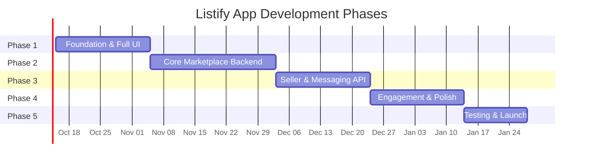

# Listify App — Development Phases

> **Version:** 2.0 — Post Phase 1 Foundation  
> **Last Updated:** 2026-10-07

---

## Phase Overview

---

## Phase 1: Foundation & Authentication (3 weeks)

> **Goal:** Establish project architecture, design system, and complete auth flow.

### 1.1 Project Setup
- [x] Initialize monorepo with npm workspaces (`packages/shared`, `apps/mobile`, `apps/backend`, `apps/admin`)
- [x] Create `@listify/shared` package (6 types, 3 validators, 4 utils, 3 constants)
- [x] Merge 37 screens from part1 + part2 into `apps/mobile`
- [x] Configure `tsconfig.json` with path aliases (`@/`)
- [x] Configure React Navigation (Tab + Stack navigators — 9 files)
- [ ] Set up ESLint + Prettier
- [ ] Set up Zustand store boilerplate
- [ ] Set up API service layer (Axios instance + interceptors)
- [ ] Configure environment variables (.env)

### 1.2 Design System
- [x] Create theme tokens (`tokens.ts` — colors, typography, spacing, shadows, gradients)
- [x] Create ThemeContext (React Context, API-driven ready)
- [x] Build core components:
  - [x] `Button` (primary, secondary, outlined, social)
  - [x] `TextInput` (with icon, label, error state)
  - [x] `ListingCard` (grid, list, featured variants)
  - [x] `Avatar` (image or placeholder)
  - [x] `Badge` (Featured, Verified, New, Used, Refurbished, Negotiable)
  - [x] `EmptyState` (icon, title, description, action)
  - [x] `LoadingSkeleton` (animated shimmer)
  - [ ] `BottomSheet` (reusable modal)
  - [ ] `TabBar` (custom bottom navigation)

### 1.3 Splash & Onboarding
- [ ] Implement 4 splash/onboarding screens with gradient backgrounds
- [ ] Add swipe navigation between screens
- [ ] Add "Get Started" / "Skip" actions
- [ ] Handle first-launch detection (AsyncStorage flag)

### 1.4 Authentication Flow
- [ ] **Login Page** — Email + Password form, validation, API integration
- [ ] **Register Page** — Full Name, Phone, Email, Username, Password
- [ ] **Phone OTP** — OTP input UI, resend timer, verification API
- [ ] **Email OTP** — OTP input UI, resend timer, verification API
- [ ] **Reset Password** — Email input, reset link/OTP flow
- [ ] **Social Auth** — Apple Sign-In + Google Sign-In integration
- [ ] **Auth State** — Zustand store for tokens, user session, auto-login
- [ ] **Secure Storage** — Store tokens in `expo-secure-store`

### Phase 1 Deliverables
| Deliverable | Status |
|-------------|--------|
| Working Expo project with internal state router | ✅ Done |
| Monorepo + @listify/shared package | ✅ Done |
| 33 fully mapped screens for all features (Auth, Marketplace, Seller, Polish) | ✅ Done |
| Design system with 7+ base components | ✅ Done |
| Zero TypeScript compilation errors | ✅ Done |
| Interactive navigation wiring across all views | ✅ Done |

---

## Phase 2: Core Marketplace (4 weeks)

> **Goal:** Build the buyer-facing marketplace experience — browse, search, and view listings.

### 2.1 Homepage
- [ ] Header with logo, location selector, notification + cart icons
- [ ] Hero promotional banner with gradient + product image
- [ ] Category grid (horizontal scroll, 15+ categories with icons)
- [ ] "Near to Me" section — location-based listings (horizontal scroll)
- [ ] "Featured" section — promoted listings with badges
- [ ] Pull-to-refresh functionality
- [ ] Skeleton loading states

### 2.2 Category Details
- [ ] Category listing page with grid/list toggle
- [ ] Listing cards with thumbnail, title, price, location, date, condition tag
- [ ] Pagination / infinite scroll
- [ ] Empty state handling

### 2.3 Product Details
- [ ] Image gallery with swipeable carousel + dot indicators
- [ ] Product info: title, price (PKR), condition, location
- [ ] Contact & Communication section (Chat / Call seller)
- [ ] Key Highlights & Specs section (dynamic chips with color-coded tags)
- [ ] Seller profile card (avatar, name, VERIFIED badge, star rating)
- [ ] Similar listings section
- [ ] Bottom action bar (Make Offer, Favorite, Share)
- [ ] Report action via Safety sheet

### 2.4 Search & Filter
- [ ] Search page with search bar + auto-complete
- [ ] Recent searches (persisted in AsyncStorage)
- [ ] Search results grid
- [ ] Filter & Sort bottom sheet:
  - [ ] Price range (min/max)
  - [ ] Condition (New, Used, Refurbished)
  - [ ] Location radius
  - [ ] Category filter
  - [ ] Sort (Newest, Price Low→High, Price High→Low, Nearest)
- [ ] Active filter badges with clear all

### 2.5 Backend Integration
- [ ] Listings API — CRUD operations
- [ ] Categories API — fetch category tree
- [ ] Search API — full-text search with filters
- [ ] Image upload API — multipart form data
- [ ] Location/Geolocation service integration

### Phase 2 Deliverables
| Deliverable | Status |
|-------------|--------|
| Fully functional Homepage with real data | ⬜ (UI Complete) |
| Category browsing with pagination | ⬜ (UI Complete) |
| Detailed product view with all sections | ⬜ (UI Complete) |
| Search with filters & sort | ⬜ (UI Complete) |
| Backend APIs for listings & categories | ⬜ |

---

## Phase 3: Seller Tools & Messaging (3 weeks)

> **Goal:** Enable sellers to create listings and buyers/sellers to communicate.

### 3.1 Post an Ad Wizard
- [ ] **Select Category** — Category picker (tree navigation)
- [ ] **Step 1: Photos & Basic Info** — Multi-image picker, title input
- [ ] **Category-Specific Specs:**
  - [ ] Mobiles & Tablets — Brand, Model, Storage, Condition, PTA Status
  - [ ] Vehicles & Cars — Make, Model, Year, Mileage, Fuel, Transmission
  - [ ] Property — Type (Sale/Rent), Area, Bedrooms, Price type
- [ ] **Step 2: Description & Pricing** — Description textarea, price, negotiable toggle
- [ ] **Set Location** — Map picker with address autocomplete
- [ ] **Step 3: Review & Publish** — Full preview, edit buttons, publish CTA
- [ ] **Success Screen** — Confirmation with share option
- [ ] Form state persistence (save draft on back/exit)
- [ ] Image compression before upload

### 3.2 Seller Dashboard
- [ ] My Ads list (Active, Inactive, Pending, Expired tabs)
- [ ] Per-ad actions (Edit, Deactivate, Delete, Promote)
- [ ] View count and response metrics
- [ ] Promote/Feature upgrade option

### 3.3 Messaging System
- [ ] Conversation list (inbox) with last message preview
- [ ] Individual chat thread with message bubbles
- [ ] Real-time message delivery (WebSocket / Firebase)
- [ ] Typing indicator
- [ ] Image/attachment sharing in chat
- [ ] Quick action button from product detail → open chat with seller
- [ ] Unread message badge on tab icon

### Phase 3 Deliverables
| Deliverable | Status |
|-------------|--------|
| Multi-step ad posting wizard | ⬜ (UI Complete) |
| Category-specific forms (3 categories) | ⬜ (UI Complete) |
| Seller dashboard with ad management | ⬜ (UI Complete) |
| Real-time messaging system | ⬜ (UI Complete) |

---

## Phase 4: Engagement & Polish (3 weeks)

> **Goal:** Add engagement features, refine UX, and prepare for production quality.

### 4.1 User Profile & Settings
- [ ] Public profile view (avatar, name, listings, rating, member since)
- [ ] Edit profile (photo upload, name, bio, contact)
- [ ] Settings page:
  - [ ] Notification preferences
  - [ ] Privacy settings
  - [ ] Language selection (English only for v1)
  - [ ] Account deletion
  - [ ] Version info
  - [ ] Logout

### 4.2 Notifications
- [ ] Activity feed screen (likes, messages, system alerts)
- [ ] Push notification integration (Expo Notifications)
- [ ] In-app notification badges (tab bar, bell icon)
- [ ] Notification preferences (toggles per type)

### 4.3 Saved Ads / Favorites
- [ ] Heart icon toggle on listing cards and detail pages
- [ ] Saved ads grid page
- [ ] Persist favorites across sessions (synced with backend)
- [ ] Empty state for no saved ads

### 4.4 Safety & Moderation
- [ ] Report bottom sheet (reason selection + text input)
- [ ] Block seller functionality
- [ ] Report confirmation feedback
- [ ] Admin moderation queue (backend only)

### 4.5 UX Polish
- [ ] Smooth page transitions and animations
- [ ] Haptic feedback on key actions
- [ ] Error boundary screens
- [ ] Network error handling (offline banner)
- [ ] Empty states for all screens
- [ ] Loading skeletons across the app

### Phase 4 Deliverables
| Deliverable | Status |
|-------------|--------|
| User profile view + edit | ⬜ (UI Complete) |
| Settings with all preferences | ⬜ (UI Complete) |
| Push notifications working | ⬜ (UI Complete) |
| Saved ads / favorites system | ⬜ (UI Complete) |
| Report & moderation flow | ⬜ (UI Complete) |
| Polished animations & error handling | ⬜ |

---

## Phase 5: Testing & Launch (2 weeks)

> **Goal:** Ensure quality, performance, and prepare for app store submission.

### 5.1 Testing
- [ ] Unit tests for utility functions (Jest)
- [ ] Component tests for critical UI (React Native Testing Library)
- [ ] Integration tests for auth flow
- [ ] E2E tests for critical user journeys (Detox / Maestro)
- [ ] Performance profiling (React DevTools, Flipper)
- [ ] Memory leak detection

### 5.2 QA & Bug Fixing
- [ ] Internal QA testing (all screens, all flows)
- [ ] Fix critical and major bugs
- [ ] Cross-device testing (iPhone, Android, tablets)
- [ ] Accessibility audit

### 5.3 App Store Preparation
- [ ] App icons and splash screen (all sizes)
- [ ] App Store screenshots (6.5", 5.5", iPad)
- [ ] Play Store feature graphic
- [ ] App Store / Play Store descriptions and metadata
- [ ] Privacy policy and terms of service pages
- [ ] EAS Build configuration for iOS and Android

### 5.4 Launch
- [ ] Beta release via TestFlight + Google Play Internal Testing
- [ ] Beta feedback collection (2-3 day cycle)
- [ ] Final bug fixes from beta
- [ ] Production build via EAS
- [ ] App Store submission (iOS)
- [ ] Play Store submission (Android)
- [ ] Post-launch monitoring (Sentry, analytics)

### Phase 5 Deliverables
| Deliverable | Status |
|-------------|--------|
| 80%+ test coverage for critical flows | ⬜ |
| Zero critical bugs | ⬜ |
| App Store & Play Store submissions | ⬜ |
| Beta testing completed | ⬜ |

---

## Timeline Summary

| Phase | Duration | Target | Status |
|-------|----------|--------|--------|
| **Phase 1:** Foundation, Design System, & All UI Screens | 3 weeks | Oct 2026 | ✅ Done |
| **Phase 2:** Core Marketplace & Auth Config | 4 weeks | Nov 2026 | ⬜ Next |
| **Phase 3:** Seller & Messaging Integration | 3 weeks | Dec 2026 | ⬜ |
| **Phase 4:** Engagement, Edge Cases & Polish | 3 weeks | Jan 2027 | ⬜ |
| **Phase 5:** Testing & Launch | 2 weeks | Feb 2027 | ⬜ |
| **Total** | **~15 weeks** | **Feb 2027** | |
